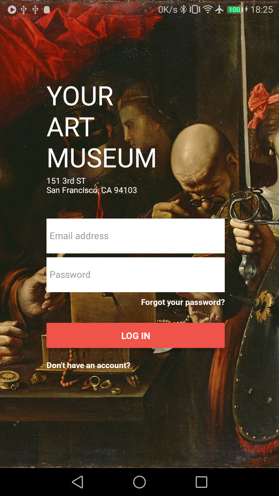
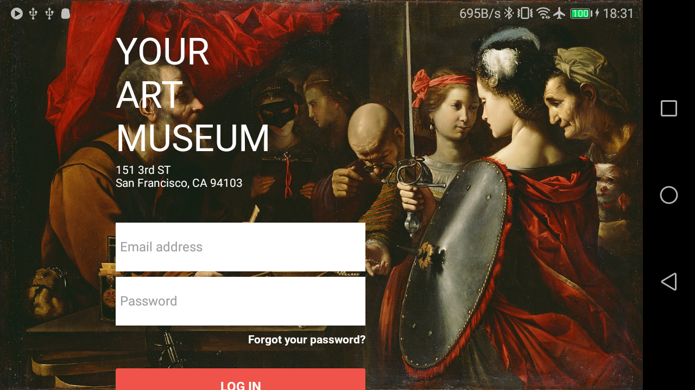
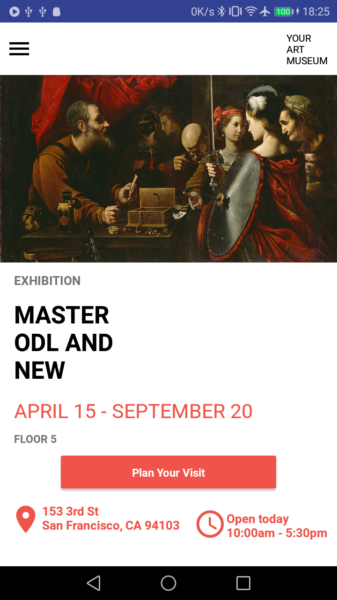
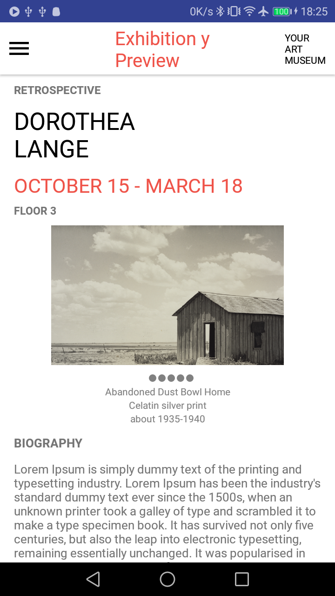

# Figma 

Proyecto basado en el Sample File de Figma (https://www.figma.com) en Rect Native.

## Getting Started

Este proyecto se realizo por diversion y para probar el Framework React Native. 
Algunos recursos para iniciar tu primer proyecto/documentación en React: 

- [Lab: Write your first React Native app](https://facebook.github.io/react-native/docs/getting-started)

# Capturas de la aplicación
Login Page

Home Page

Exhibition Page

#Proyecto similar en Flutter
Pasate a ver el mismo proyecto realizado en Flutter!
- [Flutter Figma](https://github.com/CrisRonda/flutterFigma)
